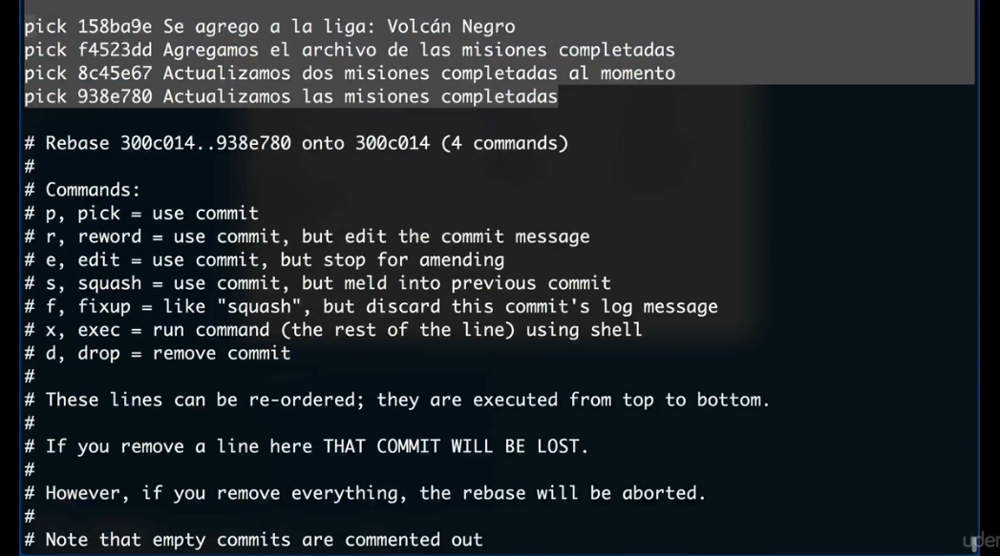

# Repositorio de información sobre Comandos de Git

1. ### Inicialización

	* __config:__ Ayuda a la configuración de las variables de entorno
		* Configurar el nombre:
		~~~
		git config --global user.name "German"
		~~~
		*  Configurar el email: 
		~~~
		git config --global user.email "test@test.com"
		~~~
		*  Ver las configuraciones: 
		~~~
		git config --global -e
		~~~
	* __init:__ Inicializa un repositorio nuevo reinicializa uno existente
		~~~
		git init
		~~~
	

2. ### Stage
	Para llevar algo al stage debemos utilizar el comando `add`:
	~~~
	git add [comandos || archivos]
	~~~
	* Ejemplos:
	~~~
	git add prueba.html  	// Empezar a seguir al archivo prueba.html
	git add css/  		// Empezar a seguir la carpeta css
	git add css/*.css 	// Empezar a seguir todos os archivos extensión .css dentro de la carpeta css
	git add .		// Seguir todo	
	git add -A	 	// Seguir todo	
	git add --all	 	// Seguir todo	
	~~~

3. ### Snapshot
	Para tomar una fotografia de la información en el stage, usaremos el comando `commit`

	* 
	~~~
	git commit -m "Mensaje"					// Sacar una foto y colocar un mensaje de que cambios se realzaron desde la foto anterior
	git commit --amend -m "Mensaje corregido"		// Corregir el mensaje del ultimo commit
	git commit -am "Mensaje"				// Incluye el <git add .> por defecto
	~~~
	* Si escribimos unicamente el comando `commit`, nos abre el editor VIM. Este editor se comanda utilizando:
		* __i -->__ Empezar a escribir
		* __Esc -->__ Salir de modo lectura
		* __:wq -->__ Salir y guardar
	~~~
	git commit
	~~~

4. ### Estado
	
	* __status:__ Nos informa el estado de la aplicaicón asi como la rama, los seguimientos y el usuario
	~~~
	git status
	~~~
	* Si queremos que sea un poco mas limpia la información
	~~~
	git status -s
	~~~
	* Si queremos que ademas de ser mas limpia, nos muestre la rama en al que estamos 
	~~~
	git status -s -b
	~~~

5. ### Reset

	* __reset:__ Nos ayuda a sacar del stage lo que querramos
	~~~
	git reset [archivos]  // Nos ayuda a sacar del stage a los archivos que no querramos alli
	~~~
	* Ejemplos: 
	~~~
	git reset prueba.html 		// Deja de seguir al archivo prueba.html
	git reset css/ 			// Deja de seguir la carpeta css 
	git reset css/*.css	 	// Deja de seguir todos os archivos extensión .css dentro de la carpeta css	
	git reset .	 		// deja de seguir todo				
	~~~
	* __reset [comandos]:__ Nos ayuda a manejar los tiempos y a recuperar archivos
	~~~
	git reset --soft [commitNumber]	// Vuelve al commit que se indica pero no recupera archivos, solo veo los cambios
	git reset --hard [commitNumber] // Vuelve al commit que se indica y recupera archivos.
	~~~

6. ### Ver información de commits

	* __log:__ Nos permite visualizar los commit realizados. Se muestran empezando en el mas cercano y desciende hacia el mas antiguo. podemos colocarle comandos que nos permita ver mejor la información.
	~~~
	git log [comandos]
	~~~
	* Algunos comandos:
	~~~
	git log --oneline 				// Ver solo una linea de cada commit
	git log --decorate				// Visualizar una forma estilizada de mostrar los elementos
	git log --graph 				// Nos muestra las ramas y los commits con un grafico de canicas
	git log	--oneline --decorate --all --graph 	// todo lo anterior junto
	~~~
	* __show:__ Nos muestra los cambios realizados en un tag especifico.
	~~~
	git show [nombreDelTag]				// Nos muestra el contenido de todo lo que el tag enmarca
	git show stash					// Nos muestra aun mas información de los stash
	git show stash@{1}				// Nos muestra aun mas información de un stash en particular
	~~~
	* __diff:__ Nos muestra la diferencia entre 2 archivos o el mismo archivo en 2 momentos distintos
	~~~
	git diff prueba.html 				// Diferencia entre el archivo prueba.html ahora y en el commit pasado
	~~~

7. ### Alias

	* __alias:__ Cambia el uso del comando por el del alias elegido.
	~~~
	git config --global alias.[aliasElegido] "[comando]"
	~~~ 
	* Ejemplo: 
	~~~
	git config --global alias.s "status"  // Ahora el 'git status' puede ponerse como 'git s'
	~~~ 
	*  Ver las configuraciones de alias: 
	~~~
	git config --global -e
	~~~

8. ## Unir ramas (MERGE)

	* __merge:__ Nos permite unir ramas distintas del hilo de commits.
	~~~
	git merge nuevaRama  // Estando en la rama principal, la uno con la rama nuevaRama
	~~~

9. ### Etiquetas (TAGS)
    
	* __tag:__ Son un acceso a un commit especifico en el tiempo. Nos permite trabajar dentro de una versión especifica del código que determinamos nosotros. Esta versión puede verse como una etiqueta que nos permitirá descargar el proyecto en ese punto.
	~~~
	git tag [comandos]
	~~~
    * Ejemplos:
	~~~
    git tag 					// Ver en la etiqueta que estamos trabajando
    git tag version1 				// Se crea la etiqueta version1 y se le coloca a la rama que estemos trabajando
    git tag -d version1 				// Borra la etiqueta versión1
    git tag -a v1.0.0 -m "Mensaje" 			// Se le da a la etiqueta una version y se le coloca un mensaje explicativo
    git tag -a v0.0.1 [commitNumber]  -m "Mensaje 	// Idem que el anterior pero en el commit expecificado
	~~~

10. ### Movilidad entre commits y ramas
    
	* __checkout:__ Nos permite movernos entre tiempos (commits) y ramas dependiendo de como configuremos los operadores y comandos que le pasemos.
	~~~
	git checkout [comandos]
	~~~
	* Ejemplos: 
	~~~
	git checkout .			// Volvemos todos los cambios a la foto (commit) anterior.
	git checkout -- prueba.html	// Volvemos los cambios a la foto (commit) anterior del archivo prueba.html solamente			
	git checkout nuevaRama		// Me muevo a la rama nuevaRama	
	git checkout -b nuevaRama	// Crea la rama nuevaRama y me dirije a ella		
	~~~

11. ### Versiones de emergencia
    
	* __stash:__ Nos permite dejar en susupenso todo el __status__ como si no hubiesemos cambia do nada desde el ultimo commit. De emergencia podemos trabajar con ese estado anterior como si los cambios hechos posteriormente no existieran. Cuando termino de trabajar y he realizado el commit correspondiente, puedo devolver lo suspendido y terminar de trabajar. Resumiendo, guarda un *trabajo en progreso*
	~~~
	Crear
	=====
	git stash						// Suspende mis cambios hasta nuevo aviso. Puedo hacerlo tantas veces quiera.
	git stash save "Mensaje"				// Crea el stash y le coloca un mensaje

	Utilizar
	========
	git stash apply						// Me devuelve lo que esta suspendido en el ultimo stash pero no lo borra.
	git stash apply stash@{1}				// Restaurar un stash en particular
	git stash pop						// Borra el ultimo stash y me devuelve lo que estaba suspendido.

	Borrar
	======
	git stash drop						// Borra el ultimo stash almacenado
	git stash drop stash@{1}				// Borra un stash en particular
	git stash clear						// Borra todos los stash guardados

	Ver
	===
	git stash list						// Me permite ver la lista de stashs realizados
	git stash list --stat					// Nos muestra mas información sobre lo que tienen los stash
	git show stash						// Nos muestra aun mas información de los stash
	git show stash@{1}					// Nos muestra aun mas información de un stash en particular
	
	Avanzados
	=========
	git stash save --keep-index				// Guarda todo menos los archivos del stage
	git stash save --include-untracked			// Guarda todo incluyendo los archivos que git no sigue
	~~~ 

	* __rebase:__ Nos permite hacer que una rama parta de otro lugar, incorporando los commits que fueron creados en paralelo. Ejemplo: Despues del commit 1 realizo un branch y empiezo a codificar ahi el commit 2 y 3. Luego vuelvo a la rama principal y codifico el commit 4 y 5. En este momento, la base de la nueva rama (de donde partio y, por lo tanto la informacion que trae de base), es el commit 1 y no tiene ningún conoccimiento del commit 4 y del commit 5. Pero me doy cuenta que estaría bien si para trabajar en la nueva rama tambien incluyo lo que desarrollé en la rama original, por lo que estaría bueno mover la base de la nueva a rama al commit 5. Entonces, desde la rama nueva realizo un comando `rebase` y coloco la base en el commit 5. Quedando este orden: [1,4,5 (de aca nace la nueva rama),nueva-rama(2,3)]
	~~~
	git rebase [ramaQueVoyaIncorporar]
	~~~
	* __rebase -i:__ Nos permite unir, dividir y eliminar commits de nuestra linea de tiempo.
	~~~
	git rebase -i HEAD~4		// El 4 representa la cantidad de archivos con los que quiero trabajar
	~~~
	Una vez ejecutado esto, se abre un menu iteractivo en la consola que nos permite trabajar con los commits que seleccionamos.

	

	De esta manera podemos trabajar con los commits moviendonos con las teclas direccionales y escribiendo con el teclado. Las palabras delante de los commits (por defecto dicen pick), nos permitiran realizarle cambios y alteraciones:

      - Pick: Devolver el commit en ese orden
      - reword: Devolver el commit pero alterando el mensaje del mismo
      - squash: Devolver el commit pero mezclarlo con el commit anterior (en este cso el de arriba al que lo coloquemos squash adelante)
      - drop: Elimina el commit

11. ### Manejo remoto
    
	* __push:__ Nos permite subir el repositorio a nuestro repositorio remoto y que sea almacenado en la nube.
	~~~
	git push nombreDelRemoto nombreDeLaRama		// Tanto el nombre del repositorio y de la rama son opcionales, pero si no se coloca, se utilizará por default 'origin master'.
	git push nombreDelRemoto :nombreDeLaRamaRemota	// Borra la rama remota completamente
	~~~
	* __pull:__ Nos permite traer todos los cambios realizados en el repositorio remoto y que no estan en nuestro repositorio local. Al terminar, realiza un merge.
	~~~
	git pull		// Modo simple.
	git pull --all		// Trae todas las ramas
	~~~
	* __clone:__ Nos permite clonar en nuestra computadora un repositorio de la nube. Se clonan los archivos, las etiquetas, los commits y demases.
	~~~
	git clone https://github.com/tu_usario/tu_repositorio.git nombreOpcionalDelLocal		// De esta manera puedo renombrar tambien.
	~~~
	* __fetch:__ Realiza la misma tarea que el `pull`, pero sin el merge automatico. Esto nos da una instancia adicional para chequear que lo que traemos del repositorio remoto no choque con algo que hayamos agregado en el local.
	* __remote:__ Nos ayuda a maneajar las subscripciones remotas con las que trabajamos
	~~~
	git remote add nombreDelRemoto https://github.com/tu_usario/tu_repositorio.git		// Por lo general, el remoto principal se llama origin y el de donde traemos un fork, lo llamamos upstream.
	~~~